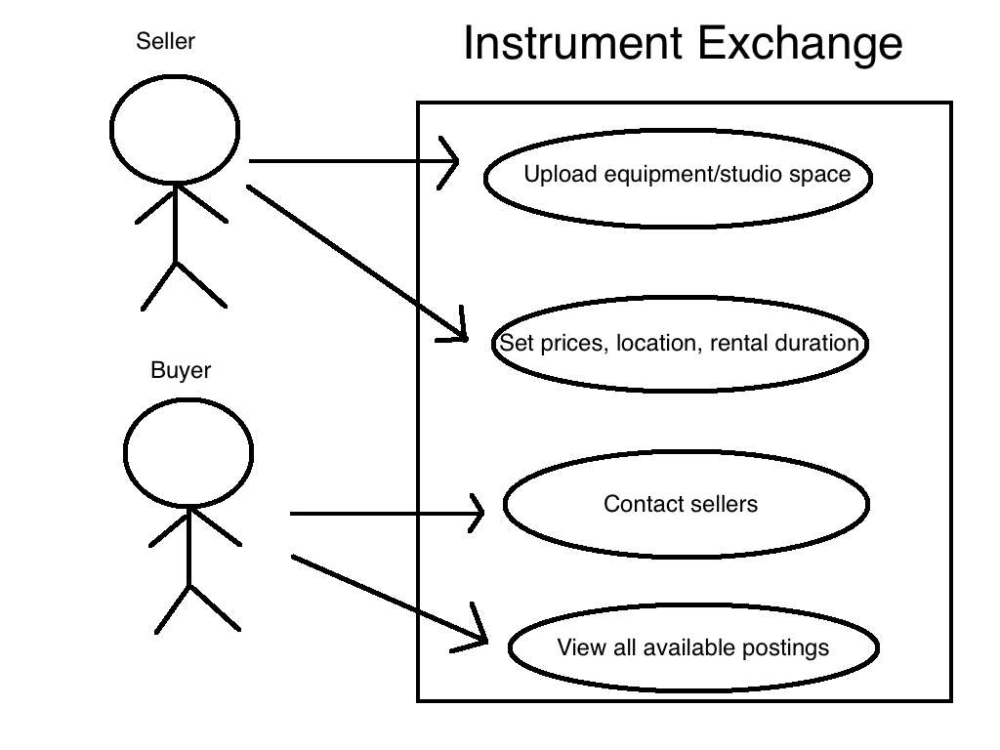

## End-User Observations

### Daniel Lee
Location: New York, NY

Biography: Daniel is a working guitarist located in New York City. He is looking to upgrade
his electric guitar to a very specific Stratocaster for a sharper sound. He has read online
that this guitar is perfect for the genre of music that he plays, but he can’t be sure until
he tries the guitar for himself. However, because he is a musician he does not have much
disposable income and he cannot afford to simply splurge on this pricey guitar, and local
guitar stores don’t have the model in stock. Instrument Exchange is perfect for Daniel
because he can rent out the model for a few days and try it at a few shows before deciding if it’s worth buying.

### Jessica Walton
Location: Nashville, TN

Biography: Jessica is an aspiring studio owner working in Nashville. Her studio has a lot of
high-end equipment including high-quality microphones and acoustic guitars. Since there are a lot of
aspiring singer-songwriters in Nashville, she wants to advertise to these musicians that they can use
the equipment in her studio for a low price to record or rehearse. Using Instrument Exchange, 
local studio owners like Jessica can list their inventory of equipment, recording rates, and available spaces. 
Musicians can browse Instrument Exchange to find spaces that they can afford and that have the equipment they need in stock.

### Joseph Kim
Location: San Jose, CA

Biography: Joseph runs a podcast about education that is quickly rising in popularity.
His discussion has garnered a lot of attention, and he now wants to upgrade microphones
for both himself and his co-hosts. He’s heard Shure and Neumann both make great 
microphones, but he doesn’t know which would be better for his show until he tries 
them both. Joseph could use Instrument Exchange to rent both brands of microphones 
for a period, record podcasts with both and then receive feedback from his audience 
about which one is better without needing to invest a full $3000 in a microphone he may not even like.

## Use Cases

